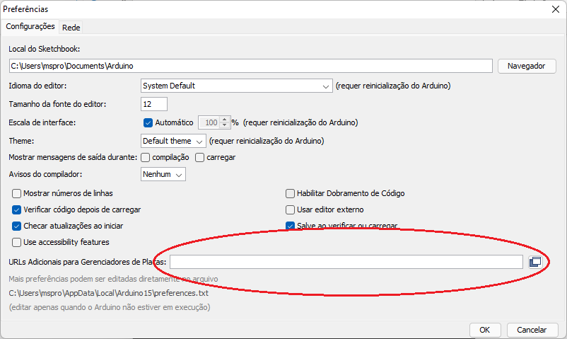

# Servidor e Conexão dos Dispositivos IoT NodeMCU/ESP8266 Usando a Rede Local

Este sistema faz parte de um trabalho desenvolvido por mim em um projeto de pesquisa do curso de Engenharia Elétrica do IFSC, e consiste em um Sistema IoT de interface Web e sistema embarcado ESP83266 capaz de receber, armazenar e exibir dados provenientes dessa plataforma. Foi aplicado em projetos relacionados a monitorametne energético e telemetria de motores elétricos de grande porte. Atualmente está sendo desenvolvida e será publicada uma nova versão deste sistema. 

Esta documentação trata de sua implementação na rede local e de sua integrção com o ESP8266. 

# Sumário

[Instalação e Configuração dos Softwares Necessários](#_Toc108017813)

[Arduino IDE](#_Toc108017814)

[Driver e Script do NodeMCU para ESP8266](#_Toc108017815)

[Configuração do ESP8266 usando módulo FTDI flash](#_Toc108017816)

[Teste da Instalação](#_Toc108017817)

[Instalação do Software XAMPP](#_Toc108017818)

[Lançamento do Banco de Dados e Site](#_Toc108017819)

[Configurando o Banco MySQL](#_Toc108017820)

[Configurando a Página Web](#_Toc108017821)

[Conectando o ESP2866 ao Wi-Fi](#_Toc108017822)

[Programação da Placa](#_Toc108017823)

[Teste Final](#_Toc108017824)

[Referências](#_Toc108017825)

# Instalação e Configuração dos Softwares Necessários

Pré-requisitos:

- Computador Windows:

- Windows 7 ou posterior;
- Processador Pentium 2 (1999) ou superior;
- 128 MB de RAM ou mais;
- 20 GB de memória em disco ou mais;

- Conexão com Internet Wi-Fi;
- Cabo USB/MicroUSB;
- Placa NodeMCU com ESP8266, ou módulo FTDI flash e ESP8266 isolado.

## Arduino IDE

Para instalar a interface de desenvolvimento Arduino, basta baixá-la no site [https://www.arduino.cc/en/software](https://www.arduino.cc/en/software) e instalar o executável disponível para download (conforme destacado na figura 1), dando todas as permissões necessárias.


_Figura 1: Download da IDE Arduino._

## Driver e Script do NodeMCU para ESP8266

Após instalado o IDE Arduino, é necessário configurá-lo para trabalhar com o ESP8266. Para tal, se faz necessário fazer as etapas a seguir:

- Primeiramente é necessário instalar o seguinte driver, disponível no link: [https://github.com/nodemcu/nodemcu-devkit/tree/master/Drivers](https://github.com/nodemcu/nodemcu-devkit/tree/master/Drivers)

- Em seguida, é necessário inserir a seguinte URL dentro das preferências do Arduino IDE (vide tela exibida na figura 2):
```
http://arduino.esp8266.com/stable/package\_esp8266com\_index.json
```



_Figura 2: Preferências no IDE Arduino, com destaque na região onde deve-se colar a URL (link do script)._

- Então, instala-se o gerenciador de placa para o ESP8266, conforme as figuras 3 e 4:


_Figura 3: Acesso ao gerenciador de placas._


_Figura 4: Busca e Instalação da Placa ESP8266._

## Configuração do ESP8266 usando módulo FTDI flash

Para configurar o ESP8266 usando um módulo FTDI flash (sem usar a placa NodeMCU – se estiveres usando o ESP com essa placa, pule esta seção), além de se fazer todas as instalações e configurações já apresentadas neste tutorial, é necessário montar um circuito para fornecer os níveis de tensão ideias (3.3 V) nas portas necessárias e fazer um esquema de ligação com o FTDI Flash para assim poder gravar na memória do ESP. Vide figuras 6 e 7 para o circuito citado.


_Figura 5: Disponibilidade dos pinos_


_Figura 6: Esquema da ligação dos pinos_

Os principais pinos são: GPIO0, GPIO2 e GPIO15 – Pinos para configuração do boot (se for ligado conforme o esquema da figura 8, o ESP8266 inicializará normalmente dando boot pela SPI Flash)

- Botão Reset – ao ser pressionado o ESP8266 reiniciará.
- Botão Upload – Usado para gravar um novo firmware na memória e funciona da seguinte maneira:

- Aperte o botão Upload e mantenha pressionado.
- Aperte e solte o botão Reset.
- Solte o botão Upload.

Fazendo a sequência do botão upload, o ESP8266 entrará em modo de programação até que seja reiniciado. Para poder programá-lo é necessário alterar a placa no Arduino IDE para "_Generic ESP8266 Module_" conforme ilustra a figura 9.


_Figura 7: Alteração da placa na IDE._

Além disso, para se enviar a programação para o ESP bem como monitorar o seu funcionamento é necessário usar a comunicação pela porta serial (FTDI Flash). O ESP8266 não possui uma porta USB nativa, por isto para obtermos tal porta, é necessário colocarmos um adaptador USB/SERIAL, conforme a figura 10. **Não se esqueça de ligar o pino TX do FTDI com o RX do ESP, e vice e versa.**


_Figura 8: Comunicação com o computador pela porta serial_

Feito todos esses passos, carrega-se o código para o ESP e quando finalizado pressiona-se o botão **reset** no circuito daFigura 6, dessa forma ele passará a executar o código enviado.

## Teste da Instalação

É possível testar se o computador está se comunicando corretamente com a placa, executando um código de exemplo conforme as imagens 5 e 6 e inserindo o código a seguir.


_Figura 9: Seleção da placa instalada (para ESP apenas, selecionar Generic ESP8266 Module)._


_Figura 10: Seleção da porta disponível._

Vide abaixo o código para teste. Basta copiá-lo na IDE e lançar para a placa.

**void setup() {**

**pinMode(LED\_BUILTIN, OUTPUT);**

**}**

**void loop() {**

**digitalWrite(LED\_BUILTIN, HIGH);**

**delay(1000);**

**digitalWrite(LED\_BUILTIN, LOW);**

**delay(1000);**

**}**

Esse código faz o led da placa NodeMCU/ESP piscar em 1Hz, ou seja, se a luz piscar a cada segundo a placa e a IDE estão devidamente instaladas. Os códigos referentes à comunicação do ESP com o sistema, serão expostos nesse texto nas próximas seções.

## Instalação do Software XAMPP

O XAMPP é um pacote com os principais servidores de código aberto do mercado, incluindo FTP, banco de dados MySQL e Apache com suporte a linguagem PHP. Ele servirá para hospedar o banco de dados MySQL e o sistema localmente em seu PC com Windows.

O pacote de instalação pode ser baixado no seguinte link: [https://www.apachefriends.org/pt\_br/index.html](https://www.apachefriends.org/pt_br/index.html)

Basta baixar, executar, selecionar todos os pacotes e dar as permissões necessárias para instalar. Vide figura 11.


_Figura 11: Download do XAMPP._

# Lançamento do Banco de Dados e Site

## Configurando o Banco MySQL

Primeiramente inicia-se o XAMPP e ativa-se os seguintes módulos destacados na figura 12.


_Figura 12: Interface XAMPP com os módulos a se ativar destacados._

Depois de ativar os módulos, acessa-se o seguinte endereço através de qualquer navegador Web de seu computador:

```
localhost/phpmyadmin/
```

Na plataforma acessada, será criado o baco de dados do sistema. Para isso, seleciona-se "novo" e define-se o nome para o banco de dados como " **dados-sistema-iot**", conforme figura 13.


_Figura 13: Criação do banco de dados._

Feito isso, cola-se o código do banco de dados do sistema dentro da guia "SQL". Tal código pode ser acessado no link a seguir (subpasta "Banco de dados"): [https://github.com/mwsprotte/repositorio-sistema-iot.git](https://github.com/mwsprotte/repositorio-sistema-iot.git)

Uma vez inserido o código, dá-se o comando executar, conforme destacado na figura 14.


_Figura 14: Comando para a criação do banco de dados._

## Configurando a Página Web

Os arquivos da página Web do sistema podem ser baixados no seguinte link: [https://github.com/mwsprotte/repositorio-sistema-iot.git](https://github.com/mwsprotte/repositorio-sistema-iot.git)

A pasta "sistema-iot" dentro desse arquivo contém o site e deve ser movida para dentro do seguinte caminho em seu computador:

**C:\xampp\htdocs**

Para acessar e testar o site, é necessário conhecer o endereço IpV4 do seu dispositivo. Isso pode ser feito da seguinte forma: abre-se o aplicativo nativo do Windows chamado "Prompt de Comando" e insere-se o comando a seguir.

**Ipconfig**

o prompt retornará vários dados de rede, guarde o seu endereço IPv4.

Com o IPv4 obtido, monta-se a seguinte URL em qualquer navegador:

**XXX/sistema-iot**

Sendo XXX o IPv4 obtido. Se o endereço estiver correto, dará acesso à um site como o da figura 15. Este site poderá ser acessado de qualquer dispositivo conectado à rede, a partir desse mesmo endereço. Podes interagir com ele criando uma conta para ter acesso ao resto da plataforma.


_Figura 15: Website._

# Conectando o ESP2866 ao Wi-Fi

## Programação da Placa

Com o Arduino instalado e o sensor devidamente reconhecido, carrega-se o código arduino presente no link abaixo (subpasta "Código Microcontrolador"). **Esse código precisa ser alterado conforme os atributos da sua rede** (nome, senha, ips etc.), os comentários instruem sobre essas mudanças (é necessário prestar bastante atenção neles). Link: [https://github.com/mwsprotte/repositorio-sistema-iot.git](https://github.com/mwsprotte/repositorio-sistema-iot.git)

## Teste Final

Uma forma eficaz de testar se a placa está enviando os dados corretamente via Wi-Fi ao sistema, é acessar a tabela do próprio banco de dados criado. Para isso, executa-se as seguintes etapas:

- Com o XAMPP devidamente iniciado como descrito anteriormente e o(s) sensor(es) rodando o código abordado acima por pelo menos cinco segundos, acessa-se o seguinte endereço, a partir de qualquer navegador de seu computador: [http://localhost/phpmyadmin/](http://localhost/phpmyadmin/)
- Então, seleciona-se o banco de dados criado (dados-sistema-iot), e a tabela correspondente aos dados recebidos (tb\_dados), conforme figura 16.


_Figura 16: Caminho para acessar os dados recebidos_.

Todos os dados recebidos são acompanhados com a data e horário correspondente, se ao acessar a tabela existirem dados com o dia e horário deste teste, os sensores estão enviando dados ao sistema corretamente.

# Referências

ARDUINO. **Using Arduino IDE to Program NodeMCU.** Disponível em: \<[https://create.arduino.cc/projecthub/najad/using-arduino-ide-to-program-nodemcu-33e899](https://create.arduino.cc/projecthub/najad/using-arduino-ide-to-program-nodemcu-33e899)\>. Acesso em: 20 fev. 2022.

MYTECTUTOR. **How to Connect ESP8266 TO MYSQL Database Using PHP and Arduino IDE**. \< [https://mytectutor.com/how-to-connect-esp8266-to-mysql-database-using-php-and-arduino-ide/](https://mytectutor.com/how-to-connect-esp8266-to-mysql-database-using-php-and-arduino-ide/)\>. Acesso em: 20 fev. 2022.

CLUBE DO HARDWARE. **Tutorial ESP8266 - Primeiros passos ESP12 + IDE Arduíno.** \<[https://www.clubedohardware.com.br/forums/topic/1206440-tutorial-esp8266-primeiros-passos-esp12-ide-ardu%C3%ADno/](https://www.clubedohardware.com.br/forums/topic/1206440-tutorial-esp8266-primeiros-passos-esp12-ide-ardu%C3%ADno/)\>. Acesso em: 20 fev. 2022.
